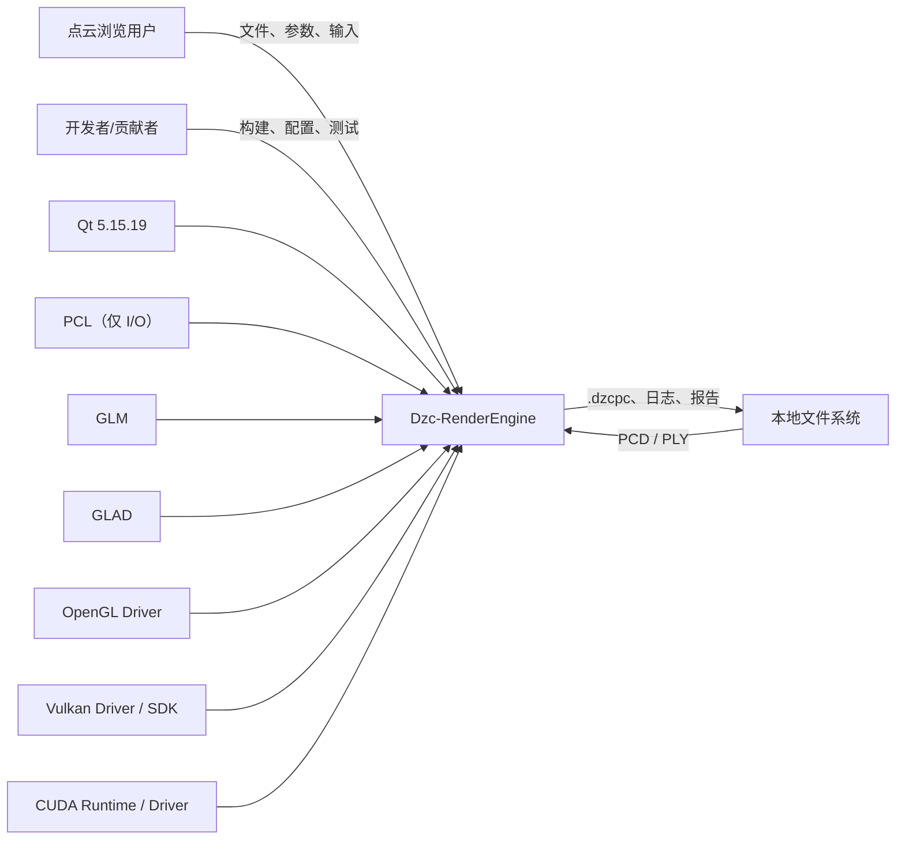
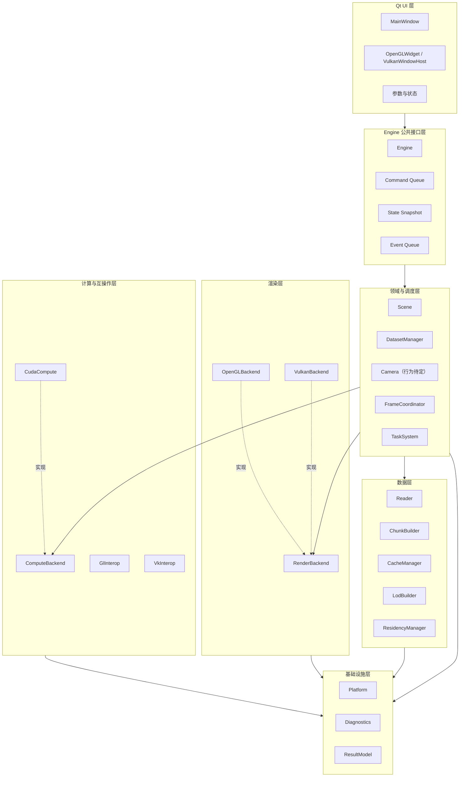
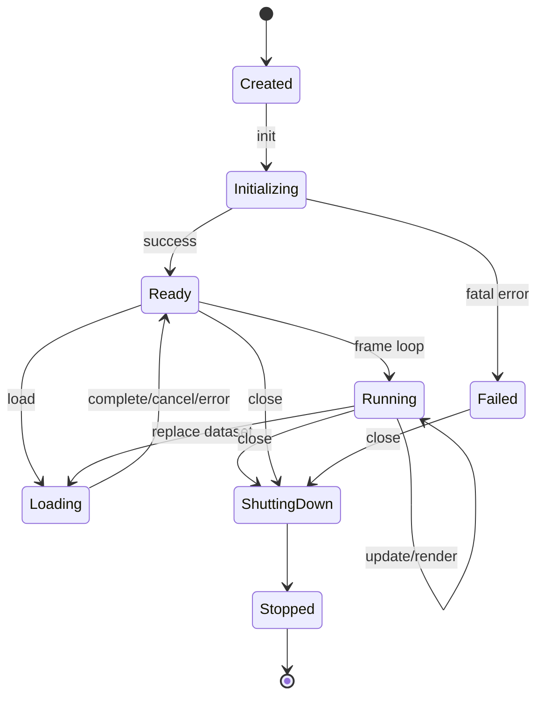
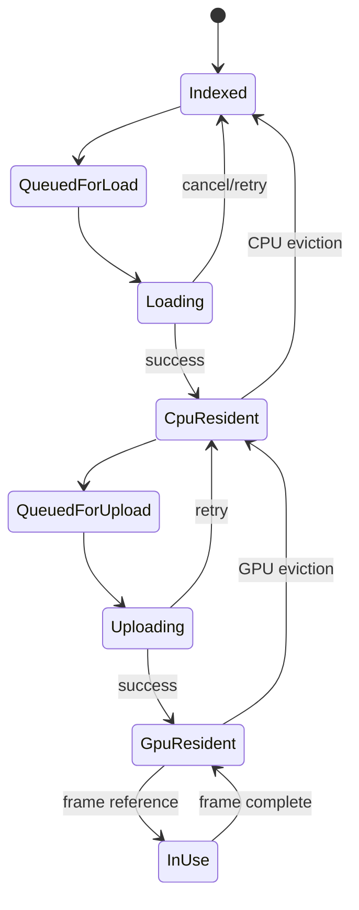
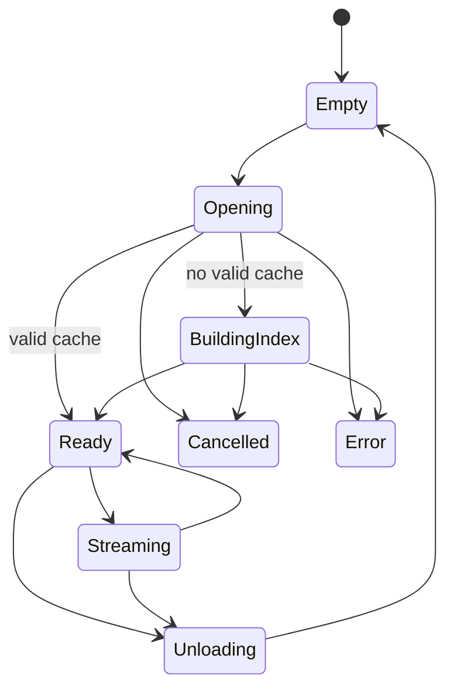
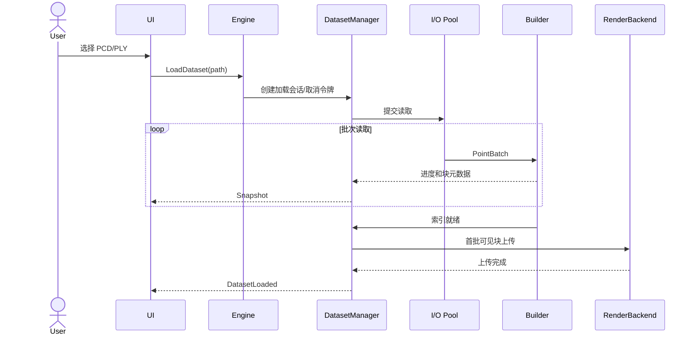
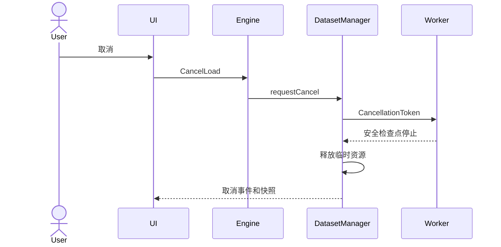
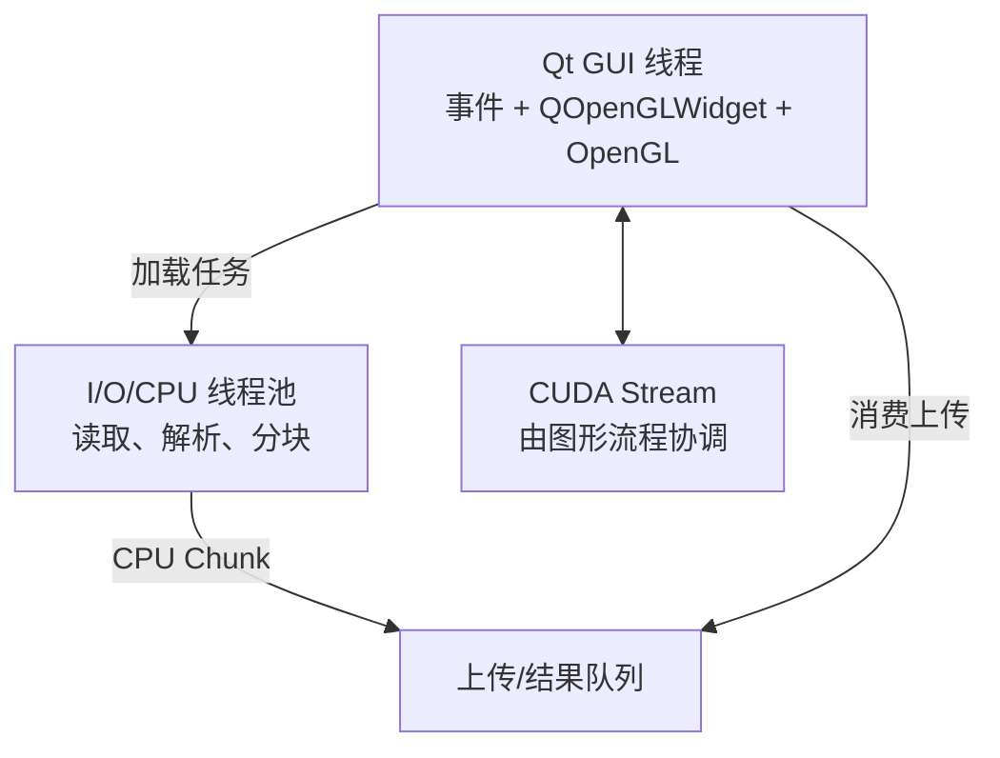
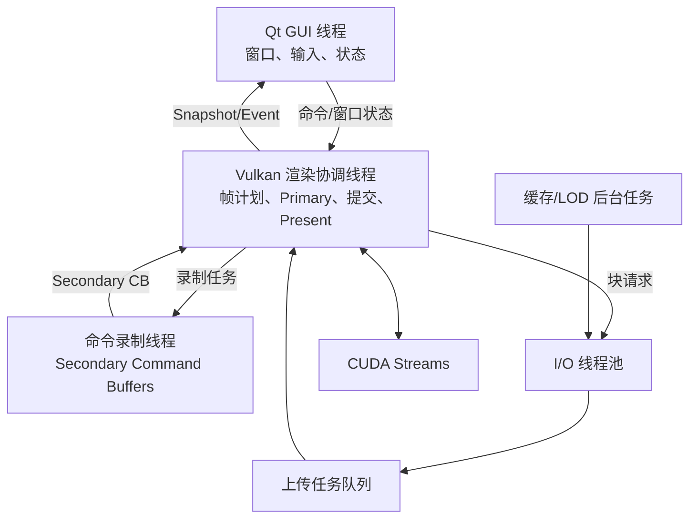
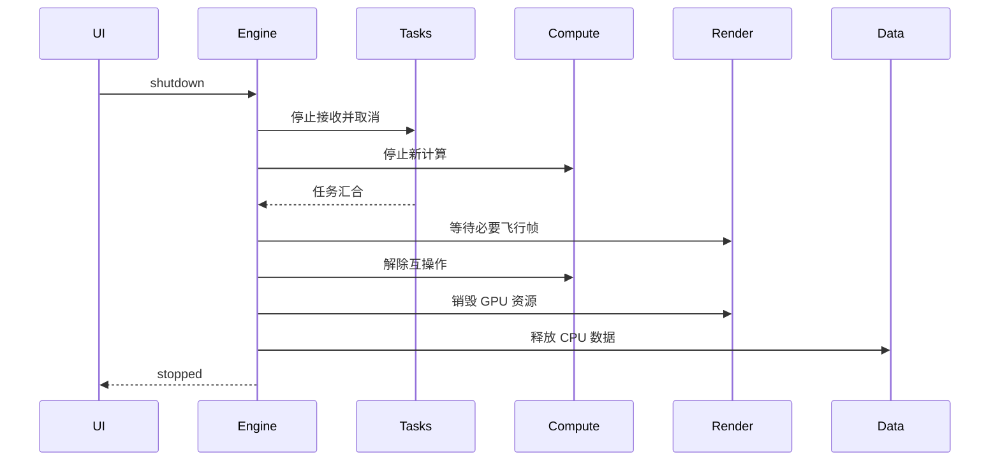

# Dzc-RenderEngine 概要设计说明书

> 文档路径：`docs/design/architectureDesign.md`  
> 项目性质：个人开源项目  
> 文档版本：0.1.0  
> 文档状态：初始架构基线  
> 编制日期：2026-08-13  
> 需求基线：[`docs/requirements/spec.md`](../requirements/spec.md)  
> 项目规范：[`agent.md`](../../agent.md)

## 1. 文档说明

### 1.1 编写目的

本文档依据软件需求规格说明书和项目规范，定义 Dzc-RenderEngine 的总体架构、模块边界、依赖方向、线程模型、核心数据模型、渲染后端、CUDA 互操作、资源生命周期、错误处理、构建组织和需求追踪关系。

本文档属于概要设计，不给出全部类成员、最终函数签名或算法实现。详细类设计、Shader 接口、缓存二进制字段等内容应在详细设计阶段补充，但不得违反本文档确定的边界。

### 1.2 适用范围

本文档同时覆盖：

- **Phase 1：OpenGL 基础渲染架构**；
- **Phase 2：Vulkan 高性能目标架构**；
- 两阶段之间保持公共接口稳定的迁移方式。

项目必须先完成 Phase 1，再进入 Phase 2。Phase 2 是新增 Vulkan 后端和高性能调度能力，不是将 UI、数据层和业务层整体重写。

### 1.3 设计原则

1. **高内聚、低耦合**：模块只承担明确职责。
2. **依赖单向**：UI 依赖 Engine，Engine 不依赖 Qt UI。
3. **接口最小化**：公共头文件不暴露 OpenGL、Vulkan 或 CUDA 句柄。
4. **后端可替换**：OpenGL 与 Vulkan 实现同一后端抽象。
5. **所有权明确**：CPU/GPU 资源使用 RAII 管理。
6. **异步且可取消**：耗时任务不阻塞 UI，具有一致取消语义。
7. **数据驱动渲染**：渲染器消费规范化点云块，不解释 PCD/PLY。
8. **渐进式演进**：Phase 1 验证公共模型，Phase 2 增加并行、LOD 和预算管理。
9. **可诊断**：重要状态、错误和性能数据可以记录、复现和验证。
10. **不补全待定项**：相机交互、基准硬件和低帧率百分位继续保持待确定。

### 1.4 术语

| 术语 | 本文含义 |
|---|---|
| Application | 程序入口、启动配置和 Qt 生命周期 |
| Engine | 后端无关的核心调度对象，不继承 Qt 类 |
| Render Backend | OpenGL 或 Vulkan 具体渲染实现 |
| Dataset | 一个已打开或正在打开的点云数据集 |
| Chunk | 可独立加载、剔除、上传和绘制的数据块 |
| Resident | 数据块驻留在 CPU 缓存或 GPU 显存中 |
| Snapshot | Engine 发布给 UI 的不可变状态副本 |
| Event | Engine 向 UI 报告的离散通知 |
| Command | UI 向 Engine 发送的操作请求 |
| `.dzcpc` | Phase 2 内部版本化点云缓存，不是公开交换格式 |

## 2. 架构目标与约束

### 2.1 质量目标

| 优先级 | 质量属性 | 架构响应 |
|---|---|---|
| 1 | 性能 | 分块、剔除、LOD、异步 I/O、显存预算、多线程录制和 GPU 互操作 |
| 2 | 可维护性 | 分层、独立 CMake Target、Pimpl、后端抽象和明确所有权 |
| 3 | 稳定性 | 状态机、取消令牌、RAII、延迟销毁和统一错误模型 |
| 4 | 可扩展性 | Reader、RenderBackend、ComputeBackend 等受控扩展点 |
| 5 | 可测试性 | 纯数据模块、接口注入、状态快照和独立性能目标 |
| 6 | 可移植性 | 平台适配层隔离 Windows 原生窗口差异 |

### 2.2 固定技术约束

- C++17、Qt 5.15.19、CMake；
- Phase 1：OpenGL 4.5 和 `QOpenGLWidget`；
- Phase 2：Vulkan 和普通 `QWindow`；
- CUDA 只承担需求限定的 GPU 预处理；
- 数学库仅使用 GLM；
- PCL 仅用于 PCD/PLY I/O；
- OpenGL 函数加载允许使用 GLAD；
- Vulkan 显存分配、预算和淘汰由项目自行实现，不使用 VMA；
- 首版不引入 spdlog、GoogleTest；
- Vulkan Shader 在构建期由 GLSL 编译为 SPIR-V；
- 不使用 `QVulkanWindow` 承担完整 Vulkan 渲染框架。

### 2.3 已确认架构决策

| 编号 | 决策 |
|---|---|
| ADR-001 | 同一文档覆盖 OpenGL 与 Vulkan 两阶段 |
| ADR-002 | 单个程序通过启动配置选择后端 |
| ADR-003 | 模块化目录和独立 CMake Target 限制依赖 |
| ADR-004 | UI 与 Engine 使用命令队列、状态快照和事件队列 |
| ADR-005 | 两阶段采用适配各自图形 API 的线程模型 |
| ADR-006 | Phase 2 引入可删除、可重建的 `.dzcpc` 内部缓存 |
| ADR-007 | Phase 1 使用空间网格，Phase 2 使用八叉树 LOD |
| ADR-008 | 双精度原点、块局部单精度坐标、SoA 属性流 |
| ADR-009 | 使用 GLAD，Vulkan 显存管理手写 |
| ADR-010 | 普通 `QWindow` 加自主管理 Vulkan |
| ADR-011 | OpenGL 运行时编译 GLSL，Vulkan 构建期生成 SPIR-V |
| ADR-012 | 使用 `Result<T>` 和异步错误事件，异常不跨模块 |
| ADR-013 | 日志和测试基础设施首版自行实现 |
| ADR-014 | 相机和性能未决项保持待确定 |

## 3. 系统上下文



系统负责本地点云读取、规范化、分块、缓存、可见性、LOD、GPU 预处理、渲染、GUI 和诊断；不负责网络下载、复杂坐标系转换、点云编辑、通用点云算法或深度学习。

## 4. 总体逻辑架构

### 4.1 分层视图



### 4.2 依赖规则

1. `app` 依赖 `engine_api` 和 Qt，不依赖后端内部 Target。
2. `engine_core` 不依赖 Qt Widgets。
3. `render_opengl` 与 `render_vulkan` 实现 `render_api`，互不依赖。
4. `compute_cuda` 实现 `compute_api`，互操作适配器与具体后端协作。
5. PCL 类型止于 `data_io_pcl`，不得进入公共接口或渲染层。
6. `platform` 封装原生窗口；Windows 代码不得扩散到公共层。
7. 公共头文件不得包含 GLAD、Vulkan 或 CUDA 头文件。
8. CMake Target 不得形成循环依赖。

## 5. 源码与构建组织

### 5.1 目录结构

```text
Dzc-RengerEngine/
├── CMakeLists.txt
├── cmake/
├── include/dzc/
├── src/
│   ├── app/
│   ├── engine/
│   ├── scene/
│   ├── data/{io,chunk,cache,lod}/
│   ├── camera/
│   ├── render/{common,opengl,vulkan}/
│   ├── compute/{common,cuda,interop}/
│   ├── platform/
│   ├── diagnostics/
│   └── tasks/
├── shaders/{common,opengl,vulkan}/
├── tests/{unit,integration,performance}/
├── docs/{requirements,design}/
└── samples/
```

### 5.2 CMake Target

| Target | 职责 | 主要依赖 |
|---|---|---|
| `dzc_engine_api` | 公共接口与类型 | 标准库、必要 GLM 类型 |
| `dzc_engine_core` | Engine、场景、命令、状态 | API、任务、诊断、各抽象 |
| `dzc_data_core` | 数据模型、分块、缓存接口 | GLM、任务、诊断 |
| `dzc_data_pcl` | PCD/PLY 读取适配 | data core、PCL |
| `dzc_render_api` | 后端无关渲染契约 | engine API、data core |
| `dzc_render_opengl` | OpenGL 后端 | render API、GLAD、OpenGL |
| `dzc_render_vulkan` | Vulkan 后端 | render API、Vulkan、platform |
| `dzc_compute_api` | 预处理契约 | 公共类型 |
| `dzc_compute_cuda` | CUDA 预处理 | CUDA、compute API |
| `dzc_interop_gl` | CUDA-OpenGL 互操作 | CUDA、OpenGL 私有接口 |
| `dzc_interop_vk` | CUDA-Vulkan 互操作 | CUDA、Vulkan 私有接口 |
| `dzc_tasks` | 线程池、取消和队列 | 标准库 |
| `dzc_diagnostics` | 日志和性能指标 | 标准库 |
| `dzc_platform` | 原生窗口适配 | Windows API |
| `dzc_app` | Qt 程序和装配根 | Qt、engine API、已启用工厂 |

### 5.3 构建选项

```cmake
DZC_ENABLE_OPENGL=ON
DZC_ENABLE_VULKAN=OFF
DZC_ENABLE_CUDA=OFF
DZC_BUILD_TESTS=ON
```

启用后端但依赖缺失时 CMake 必须明确失败；CUDA 关闭时使用不可用能力状态，不产生 CUDA 链接依赖；运行时只能选择已编译的后端。

### 5.4 公共接口封装

`include/dzc` 只包含外部使用所需类型。Engine 私有实现使用 Pimpl；接口只接受标准类型和后端无关结构。不得暴露 Qt 类型、PCL 类型、`GLuint`、`Vk*` 或 CUDA 句柄。类名使用 PascalCase，函数和变量使用 camelCase；函数声明处提供简短注释。

## 6. 模块概要设计

### 6.1 Application 与 Qt UI

职责：创建 `QApplication`/`QMainWindow`，解析启动配置，创建 `QOpenGLWidget` 或普通 `QWindow` 容器，采集文件选择、参数和输入事件，发送 `EngineCommand`，读取 `EngineSnapshot`，消费 `EngineEvent`。

UI 不负责文件解析、分块、LOD、GPU 资源或 CUDA 调度。Qt 信号槽只存在于 UI 层；Engine 不继承 `QObject`。UI 必须将 `QString`、`QColor`、`QKeyEvent` 等转换为标准字符串、数值、枚举和抽象输入结构。

### 6.2 Engine

Engine 是后端无关核心入口，负责初始化、更新、渲染、尺寸变化、关闭、命令消费、模块协调和状态发布。



文件错误属于可恢复错误，不使整个 Engine 进入 `Failed`；只有核心后端不可恢复错误进入失败状态。

### 6.3 命令、事件和状态快照

`EngineCommand` 至少覆盖：加载、取消、卸载、点大小、着色模式、固定颜色、背景色、CUDA 开关、视图重置、抽象输入、尺寸变化和关闭。命令不得包含调用方拥有的可变裸指针。

`EngineEvent` 包含信息、警告、可恢复错误、致命错误、加载完成、加载取消和能力降级事件。

`EngineSnapshot` 至少包含：Engine/后端状态、数据集摘要、进度、FPS/帧时间、点数/块数、CPU/GPU 内存、CUDA 状态、参数和最近错误。快照发布后不可修改；可用短临界区交换 `shared_ptr<const EngineSnapshot>`，但热路径不得使用全局共享锁。

### 6.4 Scene

Scene 保存当前数据集逻辑引用、视图状态、渲染参数和只读帧输入。Scene 不拥有后端 GPU 对象；逻辑 Chunk 与 GPU 驻留资源通过稳定 ID 关联。

### 6.5 Camera

Camera 模块预留视图矩阵、投影矩阵、相机位置或等价状态、视锥体、窗口尺寸、抽象输入和重置请求。

**相机类型、按键、鼠标操作、速度、初始姿态和重置语义均待参考源码确定。** 本文只规定接口隔离和数据流，不规定具体行为。

### 6.6 PointCloudReader

采用 Reader Registry：

```text
PointCloudReader
├── PcdReader（PCL 适配）
└── PlyReader（PCL 适配）
```

Reader 校验 XYZ，识别可选 RGB/intensity，将 PCL 数据转为内部 `PointBatch`，报告进度并检查取消令牌，不向上层暴露 PCL 点类型。

亿级路径应避免要求完整 PCL 对象永久驻留；若 PCL API 存在整文件读取限制，应记录限制，并由 Phase 2 缓存降低后续打开成本。

### 6.7 ChunkBuilder

Phase 1 使用空间网格：计算边界和局部原点，将点映射到网格块，为每块生成稳定 `ChunkId`、包围盒、点数、属性掩码和 SoA 点流。网格尺寸或目标点数属于详细设计参数，不固定数值。

Phase 2 与 LodBuilder 协作生成八叉树节点和多层代表点，并写入 `.dzcpc`。

### 6.8 CacheManager

Phase 2 使用可删除、可重建的版本化 `.dzcpc`：

```text
FileHeader
DatasetMetadata
AttributeSchema
OctreeNodeTable
ChunkIndex
ChunkPayloads
OptionalIntegrityData
```

Chunk 索引至少含 `ChunkId`、LOD、父子关系、包围盒、点数、属性掩码、Payload 偏移和长度。

缓存身份由源文件规范化路径、大小、最后修改时间、缓存版本和构建参数版本组成。任一关键项不匹配即重建。缓存写入应用缓存目录，采用临时文件完成后替换，避免半完成缓存被当作有效文件。

字节序、字段宽度、压缩和校验算法属于详细设计，不在此猜测。

### 6.9 LodBuilder

Phase 2 使用八叉树。每个可绘制节点包含确定性体素代表点；远距离绘制父节点，近距离逐步用子节点替代。相同输入与参数应产生稳定结果。LOD 构建只服务可视化缓存，不作为通用下采样功能。

### 6.10 ResidencyManager

CPU 侧管理等待读取、已解码、待上传数据和 CPU 缓存预算；GPU 侧管理 Buffer、上传状态、帧引用、显存预算、延迟销毁和淘汰。

优先级至少考虑可见性、LOD 需要、距离、最近使用帧和飞行帧引用。权重属于性能调优事项，不在概要设计固定。

### 6.11 RenderBackend

RenderBackend 提供后端无关的初始化、能力查询、窗口连接、帧开始/渲染/结束、Resize、Chunk 上传/释放、参数更新、统计和关闭能力。公共契约使用项目类型，不使用底层 API 句柄。

### 6.12 ComputeBackend

ComputeBackend 提供能力检查、坐标转换、颜色计算、无效点过滤、互操作资源建立、计算提交、同步和解除注册。CUDA 不可用时使用 Disabled/Null 实现，使基础渲染无需散布条件编译。

### 6.13 TaskSystem

提供固定规模线程池、I/O/缓存/CPU 任务队列、优先级、`CancellationToken`、完成事件、有界队列/背压和安全关闭。线程数按硬件并发和后端需求计算并可配置；不得为每个 Chunk 创建系统线程。

### 6.14 Diagnostics

自有线程安全日志和指标接口支持 debug/info/warning/error/fatal、控制台、文本文件、稳定错误码、帧时间、加载时间、内存、显存和块统计。逐帧日志应聚合或采样，禁止逐点或逐命令同步写日志。

## 7. 核心数据设计

### 7.1 标识与属性模式

使用稳定内部标识：`DatasetId`、`ChunkId`、`TaskId`、`FrameId`、`ErrorCode`。公共 `DatasetHandle` 不包装 PCL 指针或 GPU 句柄。

`PointAttributeSchema` 描述必需 XYZ、可选 RGB/intensity、内部格式和属性存在性。输入字段差异在 Reader 层规范化，Shader 不解析 PCD/PLY 字段名。

### 7.2 坐标精度模型

```text
原始坐标（CPU double）
  -> 数据集原点（double）
  -> 数据块原点（double）
  -> 块局部坐标（GPU float3）
```

CPU 元数据、包围盒和世界转换使用双精度；GPU 坐标相对块原点使用单精度；每帧将块原点转换到相机附近坐标系，Shader 不直接使用巨大绝对单精度坐标。

### 7.3 GPU 属性布局

采用 SoA：

```text
PositionStream  = float3[N]
ColorStream     = rgba8[N]       // 可选
IntensityStream = internal[N]    // 可选
```

缺失属性不分配显存；着色切换不重读源文件；CUDA 可只处理相关流。Intensity 位宽和归一化规则需依据样例数据确认，当前不固定。

### 7.4 Chunk 状态机



### 7.5 数据集状态机



## 8. UI 与 Engine 通信

UI 只发送命令；Engine 在安全点消费；高频输入允许合并，加载/卸载/关闭等命令保持 FIFO；Engine 发布不可变快照。

### 8.1 加载时序



### 8.2 取消时序



取消为协作式取消，不强制终止线程。读取、分块和缓存写入必须在批次边界检查令牌。

## 9. Phase 1：OpenGL 架构

### 9.1 线程模型



OpenGL 上下文和绘制调用保留在拥有 `QOpenGLWidget` 上下文的 GUI 线程；I/O 线程不调用 OpenGL；每帧限制上传工作量，避免长时间阻塞 UI；CUDA-OpenGL 的映射、计算、解除映射和绘制顺序由帧协调逻辑保证。

### 9.2 OpenGL 组件

| 组件 | 职责 |
|---|---|
| `OpenGLBackend` | 后端生命周期和帧调度 |
| `OpenGLCapabilities` | OpenGL 4.5 和限制查询 |
| `GlBuffer` | Buffer RAII |
| `GlVertexArray` | VAO RAII |
| `GlShaderProgram` | GLSL 编译、链接和日志 |
| `GlChunkResource` | Chunk 的 GPU 属性流 |
| `GlUploadQueue` | 上下文线程上传 |
| `CudaGlInterop` | CUDA 注册、映射和同步 |

所有 OpenGL ID 只存在于后端私有实现。

### 9.3 渲染流程

1. UI 事件转换为命令和帧输入；
2. Engine 更新场景和相机抽象状态；
3. 数据层执行块级视锥体剔除；
4. 后端消费限定数量的上传任务；
5. 启用 CUDA 时映射互操作 Buffer 并预处理；
6. 解除映射，确保 OpenGL 安全读取；
7. 绑定 Shader、VAO/VBO/SSBO 和参数；
8. 按可见 Chunk 批量绘制；
9. 聚合 FPS、点数和块数；
10. 发布 Snapshot。

OpenGL Shader 运行时编译，必须输出文件、阶段和编译/链接日志。Phase 1 使用一次性 CPU 加载和空间网格分块，但 GPU 资源仍按 Chunk 管理，为 Phase 2 验证后端接口。

## 10. Phase 2：Vulkan 架构

### 10.1 窗口与 Surface

Qt 创建普通 `QWindow`；`platform` 转为 `NativeWindowDescriptor`；Windows 实现内部获取原生句柄；Vulkan 后端自行创建 Instance、Surface、PhysicalDevice、Device 和 Swapchain。未来 Linux 通过新增 Surface 适配器扩展。

### 10.2 线程模型



GUI 不等待普通帧完成；协调线程拥有帧计划和提交顺序；每个录制线程使用独立命令池或满足外部同步的资源；I/O/缓存任务不访问 Vulkan 对象。若无独立 Transfer Queue，则使用图形队列兼容路径，不假设硬件一定具有专用队列。

### 10.3 Vulkan 组件

| 组件 | 职责 |
|---|---|
| `VulkanBackend` | 总生命周期和帧协调 |
| `VulkanInstance` | Instance、调试回调、扩展 |
| `VulkanDevice` | 物理设备、逻辑设备和队列 |
| `VulkanSurface` | 平台 Surface |
| `VulkanSwapchain` | Swapchain 与重建 |
| `VulkanMemoryManager` | 内存类型、子分配、预算和释放 |
| `VulkanBuffer` | Buffer 与内存 RAII |
| `PipelineManager` | Pipeline、布局和 Cache |
| `FrameContext` | 飞行帧命令、同步和延迟销毁 |
| `CommandRecordingPool` | Secondary CB 录制任务 |
| `TransferScheduler` | 异步上传和所有权转移 |
| `VulkanChunkResource` | Chunk Vulkan 资源 |
| `CudaVulkanInterop` | 外部内存和同步 |

### 10.4 帧上下文与同步

每个 `FrameContext` 独立拥有 Primary Command Buffer、同步对象、Secondary 上下文、Chunk 租约、延迟销毁列表和统计资源。飞行帧数量属于详细设计参数。

正常逐帧不得调用 `vkDeviceWaitIdle`。资源回收依据 Fence、Timeline Semaphore 或适当完成信号。具体同步原语组合需依据最低 Vulkan 能力确认，但必须保证正确性并避免全局等待。

### 10.5 多线程命令录制

协调线程生成可见 Chunk 列表并拆分批次；工作线程使用独立命令池录制 Secondary Command Buffer，只读取不可变帧数据和稳定 GPU 资源；完成后由 Primary Command Buffer 组织并统一提交。

传统 Render Pass 或 Dynamic Rendering 的选择取决于最终 Vulkan 版本，当前不固定；无论选择何者，必须使用 Secondary Command Buffers。

### 10.6 Pipeline Cache

`PipelineManager` 负责创建 Pipeline Cache、点云 Pipeline 变体、着色模式选择和可选持久化。缓存必须校验设备/驱动兼容性，失效时安全重建。Pipeline Cache 与 `.dzcpc` 使用不同文件和版本规则。

### 10.7 自研显存管理

`VulkanMemoryManager` 处理 Memory Requirements 对齐、Memory Type 选择、Device Local/Host Visible 用途、大块分配与子分配、空闲区间合并、Staging、外部共享内存、预算和延迟释放。

具体分配算法属于详细设计。CUDA 外部共享资源可以使用兼容性要求下的专用分配，不强制进入普通 Chunk 池。

### 10.8 异步上传

```text
磁盘读取 -> CPU 解码 -> CPU Resident -> Staging -> Transfer Submit
         -> GPU 完成信号 -> GPU Resident -> 可被帧引用
```

跨队列族时处理所有权转移；上传完成前 Chunk 不进入可绘制列表；正常上传不得调用 `vkDeviceWaitIdle`。

### 10.9 Swapchain 重建

当尺寸变化、最小化或出现 out-of-date/suboptimal：暂停新呈现帧，等待与旧 Swapchain 相关的必要帧，销毁旧尺寸依赖资源，按新尺寸重建并恢复。零尺寸时等待窗口恢复，不做无关设备全局等待。

## 11. 可见性、LOD 和流式调度

Phase 1 由 CPU 对网格 Chunk 包围盒做视锥体测试，不逐点测试。

Phase 2 的 LOD 输入包括八叉树边界、误差/密度元数据、视图投影、分辨率、驻留状态和预算；输出期望节点、可绘制驻留节点、异步加载优先队列和淘汰候选。

屏幕空间误差公式、阈值和滞回参数属于详细设计。实现必须用滞回或等效方式避免相机轻微移动导致 LOD 频繁抖动。

高细节子节点未驻留时继续绘制父节点；达到替换条件后再切换，避免空洞。过渡不得长期重复绘制父子节点。

预算调度流程：读取预算与用量，计算需求，保留飞行帧引用，排序新请求，淘汰不可见且无引用的低优先级块，完成信号到达后释放，再安排上传。不得依靠分配失败作为常规控制机制。

## 12. CUDA 与图形互操作

### 12.1 能力检测和降级

`CapabilityReport` 记录 CUDA Runtime/Driver、CUDA 设备、图形设备标识、设备匹配、互操作能力及不可用原因。无 CUDA 或设备不匹配时使用禁用状态继续基础渲染；显式要求 CUDA 时返回明确错误。

### 12.2 CUDA-OpenGL

OpenGL 创建可互操作 Buffer，CUDA 注册；任务开始时映射、执行预处理、完成后解除映射，再由 OpenGL 绘制；销毁前解除注册。失败路径按已完成步骤逆序清理。

### 12.3 CUDA-Vulkan

Vulkan 创建支持外部共享的 Buffer/内存并导出平台句柄，CUDA 导入和映射；双方通过兼容外部信号量在 GPU 上协调读写，不将结果回读 CPU 再上传。具体 Windows 句柄类型和 Vulkan 扩展依据能力在详细设计确定，只存在于互操作私有实现。

### 12.4 所有权

图形后端拥有图形资源主生命周期；Interop 拥有 CUDA 注册/导入；ComputeBackend 只有计算视图。关闭顺序为停止任务、等待必要 GPU 工作、销毁计算视图、解除注册/导入、销毁图形资源。

## 13. 错误处理

同步公共操作返回 `Result<T>`，包含成功值或稳定 `ErrorCode`、用户信息、诊断信息和上下文。UI 不解析字符串决定行为。

项目公共接口不允许异常跨模块；第三方异常在适配器内部捕获并转换为 Result/Event；析构函数不抛异常。

| 类别 | 示例 | 行为 |
|---|---|---|
| 用户输入错误 | 文件损坏、缺少 XYZ | 拒绝数据集，Engine 保持可用 |
| 可选能力缺失 | CUDA 不可用 | 降级并说明 |
| 可恢复后端事件 | Swapchain 失效 | 重建相关资源 |
| 单任务错误 | 单块读取失败 | 报告、重试或降级 |
| 致命错误 | 无法创建设备 | 初始化失败或安全停止 |

日志上下文应含错误码、模块、DatasetId/ChunkId/FrameId、路径、后端、API 返回码和阶段。

## 14. 资源生命周期

单一所有者使用 `unique_ptr`，确有共享生命周期时使用 `shared_ptr`；GPU 对象使用 RAII；异步任务以租约或稳定 ID 保证有效性；公共头文件不显示后端资源。



不得先销毁图形 Buffer 再解除 CUDA 互操作；不得在线程仍可能访问时释放对象。初始化失败通过分阶段 RAII 按逆序回滚。

## 15. 性能与诊断设计

至少采集 CPU/GPU 帧时间、平滑 FPS、可见/提交点数、可见块数、CPU/GPU 驻留量、上传字节数、LOD 未命中和命令录制线程工作量。FPS 窗口参数属于详细设计。

性能测试使用独立 CMake Target 或 CTest 标签，记录硬件、驱动、数据集、后端、分辨率和运动路径。相机路径尚未确定，不得声称已有最终可重复性能场景。

热路径禁止逐点分配、逐点日志、每 Chunk 全局锁和正常帧中的 `vkDeviceWaitIdle`；上传、LOD 和缓存构建必须有背压；Snapshot 不复制完整点云。

## 16. 健壮性设计

- 检查文件尺寸、头信息、点数、偏移和缓冲长度溢出；
- 缓存索引不得越出文件范围；
- 缓存版本或身份不匹配时拒绝使用；
- Shader/Pipeline Cache 与数据缓存分离校验；
- 不修改源点云文件；
- 半完成缓存不得发布为有效文件；
- GPU 分配失败触发错误或受控淘汰，不得继续使用空资源。

## 17. 测试架构

| 层级 | 内容 |
|---|---|
| Unit | 包围盒、网格、视锥体、状态机、缓存身份、Result、取消 |
| Integration | PCD/PLY 到 Chunk、缓存、Engine 命令/快照、后端初始化 |
| Graphics | OpenGL Shader/资源、Vulkan Swapchain/同步/验证层 |
| Interop | CUDA-OpenGL/Vulkan 设备匹配和结果正确性 |
| Performance | 千万/亿级、FPS、加载、内存/显存和并行录制 |
| UI | 打开、取消、参数、状态和错误显示 |

使用 CMake/CTest 和自有轻量断言，不引入 GoogleTest。图形/CUDA 测试按能力标签区分，缺少硬件时明确跳过而非伪造通过。Engine 应支持装配 Fake/Null RenderBackend、Disabled/Fake ComputeBackend、内存 Reader、可控任务执行器和测试日志 Sink。

## 18. 阶段迁移

进入 Phase 2 前必须稳定：Engine 生命周期，Command/Event/Snapshot，Dataset/Chunk/属性/包围盒，Reader 输出，后端无关帧与上传描述，取消/错误模型和 UI 数据契约。

| Phase 1 | Phase 2 |
|---|---|
| `QOpenGLWidget` | 普通 `QWindow` Vulkan Host |
| OpenGLBackend | 新增 VulkanBackend，保留 OpenGLBackend |
| 网格 Chunk | 八叉树节点和 LOD Chunk |
| 一次性 CPU 构建 | `.dzcpc` 和异步流式读取 |
| 上下文线程绘制 | 协调线程加多录制线程 |
| GL Buffer | 自研 Vulkan MemoryManager |
| CUDA-GL | 新增 CUDA-Vulkan |
| 基础驻留 | CPU/GPU 预算和淘汰 |

不得让 UI 分后端操作 GPU 资源，不得令 Vulkan 依赖 OpenGL，不得使用 GPU ID 作为公共 Chunk 句柄，不得让 PCL 类型进入渲染层，不得删除 OpenGL 后端。

## 19. 部署与装配

概念启动配置包括：

```text
--backend=opengl|vulkan
--cuda=on|off|auto
--log-level=...
--cache-directory=...
--gpu-memory-budget=...
--cpu-cache-budget=...
```

最终参数名、默认后端、默认 CUDA 模式和默认预算尚未确认，本文不固定。

Application Composition Root 是唯一了解具体实现的位置：解析配置，创建 Platform Adapter、OpenGL/Vulkan 后端、Disabled/CUDA Compute、Reader Registry、Engine 和对应 Qt Render Host。Engine 不通过全局单例查找后端。

## 20. 需求追踪矩阵

### 20.1 功能需求

| 需求 | 设计落实位置 |
|---|---|
| FR-COM-001 | 5.3、19 |
| FR-COM-002 | 6.11、6.12、12.1 |
| FR-DATA-001 | 6.6、7.1 |
| FR-DATA-002 | 6.1 |
| FR-DATA-003 | 6.3、8、9.1、10.2 |
| FR-DATA-004 | 6.13、8.2 |
| FR-DATA-005 | 6.3、7、15 |
| FR-DATA-006 | 7.2 |
| FR-REN-001 | 6.11、9、10 |
| FR-REN-002 | 6.3、6.4 |
| FR-REN-003 | 7.1、7.3、9.3、10.6 |
| FR-REN-004 | 6.3、6.4 |
| FR-REN-005 | 6.11、10.9 |
| FR-CAM-001 | 6.1、6.5 |
| FR-CAM-002 | 6.5，保持待确定 |
| FR-CAM-003 | 6.3、6.5，行为待定 |
| FR-VIS-001 | 6.7、7.4 |
| FR-VIS-002 | 11 |
| FR-VIS-003 | 6.3、15 |
| FR-CUDA-001 | 5.3、6.12、12.1 |
| FR-CUDA-002 | 6.12、12 |
| FR-CUDA-003 | 12.2、12.3 |
| FR-CUDA-004 | 12.2-12.4 |
| FR-UI-001 | 6.1 |
| FR-UI-002 | 9.1、10.1 |
| FR-UI-003 | 6.1、6.3 |
| FR-UI-004 | 6.3 |
| FR-UI-005 | 6.14、13 |
| FR-STAT-001 | 15 |
| FR-STAT-002 | 6.14、15 |
| FR-GL-001 | 9.2 |
| FR-GL-002 | 7.3、9.2 |
| FR-GL-003 | 9.3 |
| FR-GL-004 | 12.2 |
| FR-VK-001 | 10.1、10.3 |
| FR-VK-002 | 10.9 |
| FR-VK-003 | 10.2、10.5 |
| FR-VK-004 | 10.5 |
| FR-VK-005 | 10.6 |
| FR-VK-006 | 10.7 |
| FR-VK-007 | 10.8 |
| FR-VK-008 | 10.4、10.8 |
| FR-LOD-001 | 6.9、11 |
| FR-LOD-002 | 11 |
| FR-LOD-003 | 11 |
| FR-LOD-004 | 6.10、11 |
| FR-LOD-005 | 6.10、11 |
| FR-VKCUDA-001 | 12.3 |
| FR-VKCUDA-002 | 12.3 |
| FR-VKCUDA-003 | 12.1 |

### 20.2 非功能需求

| 需求 | 设计落实位置 |
|---|---|
| NFR-PERF-001 | 9.3、11 |
| NFR-PERF-002 | 10.2、10.5、11、15 |
| NFR-PERF-003 | 8、9.1、10.2 |
| NFR-PERF-004 | 8、15 |
| NFR-REL-001 | 7.5、13 |
| NFR-REL-002 | 12.4、14 |
| NFR-REL-003 | 6.12、12.1、13 |
| NFR-MAIN-001 | 2.2、5 |
| NFR-MAIN-002 | 5.4、9.2、10.3、14 |
| NFR-MAIN-003 | 5.4、14 |
| NFR-MAIN-004 | 4.2、5.4 |
| NFR-MAIN-005 | 5.4 和项目规范 |
| NFR-MAIN-006 | 项目规范；复杂同步在 10、12、14 说明原因 |
| NFR-PORT-001 | 2.2、10.1 |
| NFR-PORT-002 | 4.2、10.1 |
| NFR-PORT-003 | 5.3、6.12、12.1 |
| NFR-TEST-001 | 15、17 |
| NFR-TEST-002 | 6.14、15、17 |

## 21. 架构验收重点

### 21.1 Phase 1

- 可以只启用 OpenGL 构建；
- OpenGL 上下文与 I/O 线程边界正确；
- UI 只通过命令/快照/事件访问 Engine；
- PCL 类型止于 Reader；
- 网格 Chunk 剔除可诊断；
- 无 CUDA 时 Null Compute 正常；
- CUDA-GL 不经过 CPU 回读再上传；
- 相机只验收输入抽象。

### 21.2 Phase 2

- Vulkan 后端独立于 OpenGL；
- 普通 `QWindow` 和自主管理 Swapchain 工作；
- 多线程实际录制 Secondary Command Buffers；
- `.dzcpc` 可失效、删除、重建；
- 八叉树 LOD 渐进显示；
- 降低预算时执行受控淘汰；
- 上传和帧循环不依赖常规 `vkDeviceWaitIdle`；
- CUDA/Vulkan 匹配同一 GPU 并使用外部同步；
- 性能在确定的基准硬件上报告和验收。

## 22. 待确定事项

### TBD-ARCH-001 相机交互

等待用户参考源码；待确定 Controller 类型、输入映射、速度、初始视图、重置语义和 UI 参数。不得预设轨道、自由漫游或具体键位。

### TBD-ARCH-002 基准硬件

等待 CPU、GPU、显存、内存、存储、驱动和 CUDA 环境；影响线程池默认规模、预算默认值和最终性能验收。

### TBD-ARCH-003 低帧率百分位

等待基准测试；当前只采用需求已确定的平均 FPS 指标。

### TBD-ARCH-004 相机性能路径

等待相机模型确定后的可重复运动路径。

### TBD-ARCH-005 详细格式与调优参数

以下内容需依据样例、API 能力或实验确定，当前不指定：

- 网格尺寸或目标块点数；
- `.dzcpc` 字段、字节序、压缩和校验；
- intensity 内部格式和归一化；
- Vulkan 最低版本及 Render Pass/Dynamic Rendering；
- 飞行帧数量和同步原语组合；
- LOD 误差公式、阈值和滞回；
- CPU/GPU 默认预算；
- 线程池和录制线程数；
- 启动参数最终名称和默认值。

## 23. 设计变更规则

改变依赖方向、后端选择方式、公共第三方依赖、内部缓存、八叉树 LOD、Vulkan 显存管理、`QWindow` 方案、SoA/精度模型、错误边界、CUDA 零拷贝、相机模块或需求追踪时，必须更新本文档并检查需求文档。变更记录需包含原因、影响模块、影响需求、迁移和验证计划。

## 24. 结论

本架构以 Engine 后端无关接口为中心，分离 Qt UI、点云 I/O、场景与分块、OpenGL/Vulkan 渲染、CUDA 互操作、任务和诊断。Phase 1 通过 OpenGL、网格分块和基础互操作验证公共模型；Phase 2 在不破坏公共边界的前提下增加 Vulkan 多线程 Secondary Command Buffer、`.dzcpc`、八叉树 LOD、异步上传和显存预算。

文档没有对相机行为、基准硬件、低帧率百分位、缓存字节布局和性能调优数值进行猜测，这些内容保持为明确待办。
